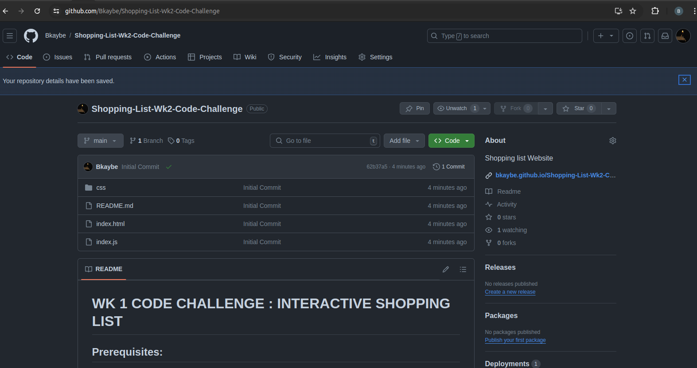

# WK 1 CODE CHALLENGE : INTERACTIVE SHOPPING LIST

## Prerequisites:

- Develop a webpage with a shopping list. Users can add items to the list, mark items as purchased, and clear the list.

### Requirements:

- Array: Maintain a JavaScript array to store shopping list items.

### DOM Manipulation:

- Create an HTML structure with an input field for adding items, a list container to display items, and buttons for "Add", "Mark Purchased", and "Clear List".
- Use JavaScript to dynamically add new items to the list container when the user clicks the "Add" button. (The new items do not have to be persisted once the page refreshes)
- Update the list item visually to indicate purchased items (e.g., strikethrough text, different background color).

### Event Handling:

- Attach event listeners to the "Add" button to capture user input and add items to the list.
- Attach event listeners to the list of items to allow users to mark them as purchased.
- Attach an event listener to the "Clear List" button to remove all items from the list

## System Requirements

- A browser capable of running Javascript, HTML and loading CSS (Chrome, Firefox)
- Operating system (Windows, Linux, MacOS)
- Text editor capable of running the program (Vs code)
- RAM above 8GB

## Installtion

### Alternative One

1. Open your terminal in Ubuntu or the CLI in windows in your machine.
2. Clone this repository to your machine by running the following command:
   `git clone git@github.com:Bkaybe/Shopping-List-Wk2-Code-Challenge.git`
3. After cloning in the desired folder you can therefore open the project folder by right clicking anywhere within the project folder and choose open in terminal then type the following command on the terminal.
   `code .`
4. It will open the project in vscode.

### Alternative two

1. The second alternative will be to download the project folder from github direct.
2. Once downloaded you can then go ahead to the downloads folder in your file system and then go ahead and unzip the compressed folder.
3. If you want to open the folder in vscode go to the vscode and launch it and then at the top left corner click on the File tab and then choose open folder and navigate to the project folder location and select it to open it.

## Running the program

- There are two ways of launching the program to interact with it.

Below are different approaches :

### First Approach: Launching the live server from Index.html

\*_Follow this steps below to launch the web page:_

1.  Open the index.html file by right clicking anywhere within the index.html file and then selecting from the dropdown list this option - **"open with liveserver"**
    **or rather**,,

- Launch the live server from the bottom right of the vscode window and then waith for the blank page to launch on your browser.

2. Once the live server has loaded and you can see the web page landing page, directly go ahead and play around with the shopping list by adding different items to the list.

3. You can also try to delete items from the list.

### Second Approach: Copying the website live link from github.

\*_Follow this steps below to launch the web page:_

1. From the github repository you can go ahead and click on the live link using located in this location as displayed in this Image below, click on the link below the about tab on the top right.

   

2. The link will take you to the live hosted website.

3. Directly go ahead and play around with the shopping list by adding different items to the list.

4. You can also try to delete items from the list.

#### Author: Bethwel Khisa
